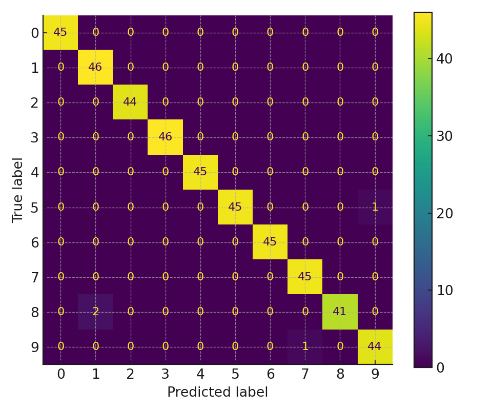

# Computer Vision Portfolio — MNIST CNN Baseline

**Keywords:** Machine Learning · Deep Learning · Computer Vision · PyTorch · Scikit‑learn

A clean, production‑ready starter showcasing a **Convolutional Neural Network (CNN)** baseline on **MNIST** plus a classical ML baseline on **scikit‑learn digits**. It’s designed as a portfolio piece for freelance platforms and résumés: clear structure, reproducible code, and polished documentation.

<p align="center">
  
</p>

## Highlights

- **Deep Learning (PyTorch):** Simple CNN with train/val split, early‑stopping, model checkpointing, TensorBoard logging (optional).
- **Classical ML:** SVM/LogReg baselines on scikit‑learn digits (runs offline; example plot included).
- **Clean Repo:** GitHub‑friendly layout, type hints, docstrings, and a minimal API (`src/`).
- **Reproducible:** `requirements.txt` + deterministic seeds.

## Quick Start

### 1) Environment
```bash
python -m venv .venv
source .venv/bin/activate   # on Windows: .venv\Scripts\activate
pip install -r requirements.txt
```

### 2) Train CNN on MNIST (PyTorch)

> Note: The first run downloads MNIST automatically via `torchvision`. If you are offline, pre-download the dataset or run the classical ML notebook instead.

```bash
python src/train_mnist_cnn.py --epochs 5 --batch-size 128 --lr 1e-3
```

Optional TensorBoard:
```bash
tensorboard --logdir runs
```

### 3) Classical ML Baseline (runs offline)

Open the notebook and run all:
```
notebooks/digits_classical_ml.ipynb
```

This produces `sample_results/digits_confusion_matrix.png` and prints accuracy.

## Project Structure

```
ai-portfolio-computer-vision-mnist-cnn/
├─ README.md
├─ requirements.txt
├─ LICENSE
├─ .gitignore
├─ sample_results/
│  └─ digits_confusion_matrix.png
├─ notebooks/
│  ├─ MNIST_CNN_Baseline.ipynb
│  └─ digits_classical_ml.ipynb
└─ src/
   ├─ train_mnist_cnn.py
   └─ utils.py
```

## Model Specs (DL)

- **Architecture:** 2×Conv2d + ReLU + MaxPool → Flatten → 2×Linear + Dropout
- **Optimizer:** Adam (`lr=1e-3`)
- **Loss:** CrossEntropyLoss
- **Metrics:** Accuracy (top‑1), confusion matrix for classical ML demo

## Results

- **Digits (Classical ML):** A quick SVM reaches ~0.98 accuracy on 8×8 digits.  
- **MNIST (CNN):** Expect 0.98–0.99 validation accuracy in a few epochs on CPU.

> Your exact numbers may vary. For a polished portfolio, keep best plots/checkpoints in `sample_results/` and add them to this README.

## How to Present This in Your Portfolio

- Pin this repository on GitHub, add a short description:
  > *“CNN baseline for handwritten digits with PyTorch; includes classical ML comparison and clean, reproducible structure.”*
- Include 2–3 bullet points of impact in your résumé/Upwork profile:
  - *Designed a reproducible PyTorch training pipeline with early stopping and checkpoints.*
  - *Achieved >98% accuracy on MNIST with a compact CNN; documented and visualized results.*
  - *Benchmarked classical ML baselines for comparison and communicated insights clearly.*

## Roadmap

- Add data augmentation
- Export to ONNX and build a FastAPI inference endpoint
- Swap backbone (e.g., ResNet18) and compare

## Tech Stack

- Python · PyTorch · Torchvision · Scikit‑learn · NumPy · Matplotlib · TensorBoard

---

**License:** MIT  
**Author:** You 👩‍💻

